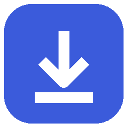
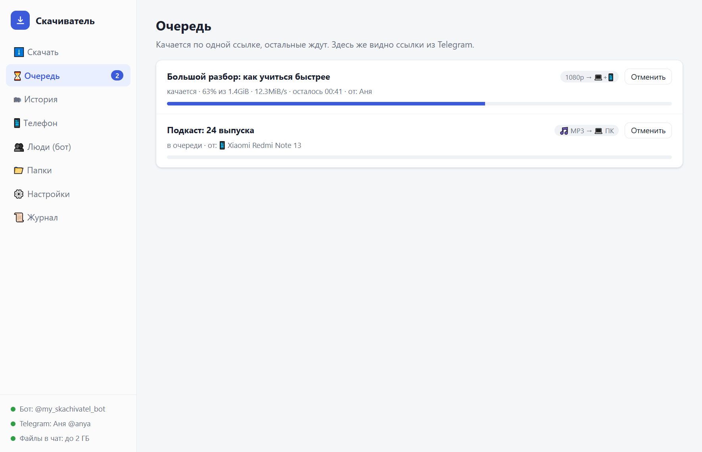
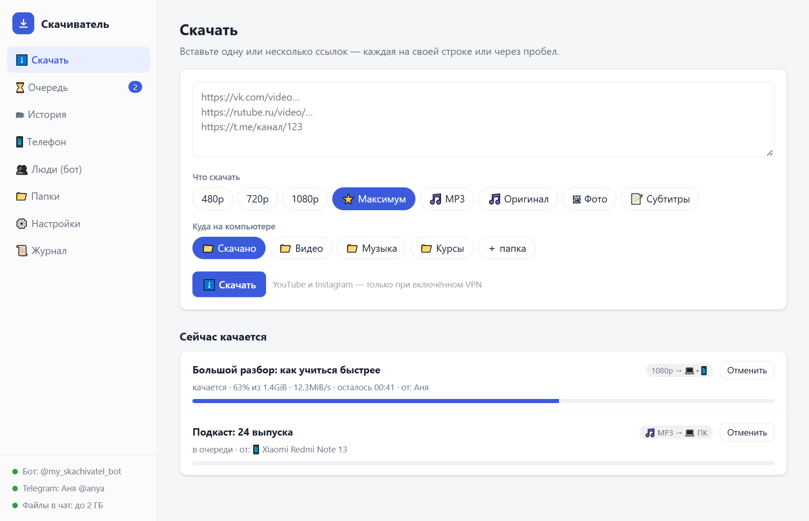
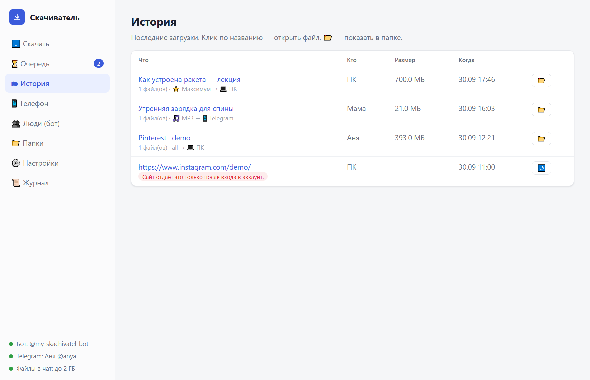
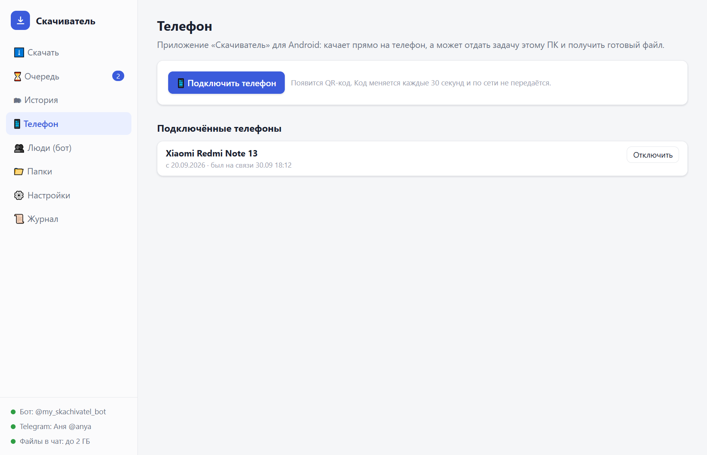
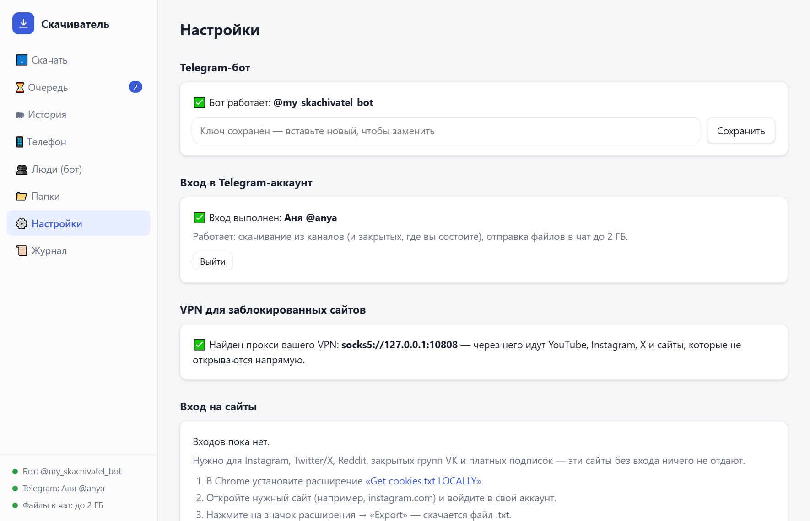

<div align="center">



# Скачиватель

**Видео, музыка и фото с YouTube, VK, Rutube, TikTok, Pinterest, Telegram и ещё ~1000 сайтов — в максимальном качестве.**
Программа для Windows, приложение для Android и Telegram-бот, которые работают вместе.

[](../../releases/latest)
[](../../releases/latest)




</div>

---

## Содержание

- [Что умеет](#что-умеет)
- [Установка на Windows](#установка-на-windows) — одна кнопка
- [Установка на Android](#установка-на-android)
- [Как пользоваться](#как-пользоваться)
- [Telegram-бот: настройка за 3 минуты](#telegram-бот-настройка-за-3-минуты)
- [Подключить телефон к ПК](#подключить-телефон-к-пк)
- [Telegram-каналы и файлы до 2 ГБ](#telegram-каналы-и-файлы-до-2-гб)
- [YouTube, Instagram и VPN](#youtube-instagram-и-vpn)
- [Instagram, X, Reddit: вход на сайты](#instagram-x-reddit-вход-на-сайты)
- [Pinterest: все доски по папкам](#pinterest-все-доски-по-папкам)
- [Какие сайты работают](#какие-сайты-работают)
- [Безопасность и приватность](#безопасность-и-приватность)
- [Частые вопросы](#частые-вопросы)
- [Сборка из исходников](#сборка-из-исходников)
- [Благодарности и лицензия](#благодарности-и-лицензия)

---

## Что умеет

| | |
|---|---|
| 🎬 **Видео в любом качестве** | Сначала показывает, что есть по ссылке: все качества (2160p, 1080p, 720p…) с **примерным размером файла** — выбираете нужное |
| 🎵 **Только звук** | MP3 320 kbps или оригинальная дорожка без перекодирования |
| 📝 **Субтитры** | Ручные и автоматические, по языкам, в `.srt` |
| 🖼 **Фото и обложки** | Оригиналы с Pinterest, VK, Instagram; обложка видео в максимальном размере |
| 📚 **Pinterest целиком** | Профиль или доска → все доски **по папкам** (и разделы внутри), в оригинальном качестве |
| 📺 **Плейлисты и каналы** | «Все видео» или «Всё аудио» одной кнопкой |
| ✈️ **Telegram-каналы** | Посты, альбомы, целые каналы — в том числе закрытые, где вы состоите |
| 🤖 **Telegram-бот** | Кинули ссылку с телефона → выбрали «что и куда» → файл на ПК или прямо в чат (до 2 ГБ) |
| 📱 **Приложение для Android** | Качает прямо на телефон. А если дома включён ПК — может отдать задачу ему и получить готовый файл |
| 👨‍👩‍👧 **Для семьи** | Несколько человек в боте (у каждого своя папка); добавляет и удаляет только владелец |
| 🛡 **Обходит блокировки через ваш VPN** | Сам находит VPN на ПК и пускает через него только заблокированные сайты |
| 🧹 **Аккуратные файлы** | Имя = название видео, никаких `[dQw4w9WgXcQ]` и временных кусков в папке |

<details>
<summary><b>Ещё снимки окна</b></summary>

| Скачать | История |
|---|---|
|  |  |
| **Телефон** | **Настройки** |
|  |  |

</details>

---

## Установка на Windows

1. Откройте **[последний выпуск](../../releases/latest)** и скачайте `Skachivatel-Setup-X.Y.Z.exe`.
2. Запустите. Права администратора **не нужны** — программа ставится в вашу папку пользователя.
   > Windows может показать «Система Windows защитила ваш компьютер» — это из-за того, что программа новая и не подписана платным сертификатом. Нажмите **«Подробнее» → «Выполнить в любом случае»**.
3. Готово: на рабочем столе появится значок **Скачиватель**. Всё нужное (движки скачивания, ffmpeg) уже внутри — ничего доустанавливать не надо.

При первом запуске Windows спросит, разрешить ли программе доступ к сети, — разрешите для **частных сетей**: это нужно, чтобы телефон мог найти ПК дома.

> **Где мои данные?** Настройки, история и входы хранятся в `%APPDATA%\Скачиватель` и **не удаляются** при переустановке. Скачанное — в `Загрузки\Скачано` (папки меняются во вкладке «📁 Папки»).

## Установка на Android

1. На телефоне откройте **[последний выпуск](../../releases/latest)** и скачайте `Skachivatel-X.Y.Z.apk`.
2. Откройте файл → разрешите установку из этого источника (Android спросит один раз) → «Установить».
3. При первом запуске приложение около минуты готовит движок — это один раз.

Нужен Android 10 или новее. Файлы сохраняются в **«Загрузки/Скачиватель»** — их видно в Галерее и в «Файлах».

---

## Как пользоваться

### На ПК
Вкладка **«⬇️ Скачать»** → вставьте одну или несколько ссылок → выберите «что» и папку → **Скачать**. Прогресс — во вкладке «⏳ Очередь», готовое — в «🗂 История».

Закрыли окно — программа продолжает работать в фоне (чтобы бот и телефон могли присылать ссылки). Открыть снова — значок на рабочем столе. Выключить совсем — «⚙️ Настройки → Выключить».

### На телефоне
В YouTube, VK, браузере, Telegram — **«Поделиться» → «Скачиватель»**. Или вставьте ссылку в приложении. Появится карточка:

```
[превью]  Название · автор · 57:05
Что скачать?     🎬 Видео  ·  🎵 Только аудио  ·  📝 Субтитры  ·  🖼 Обложка
   ↓ Видео
⭐ 1080p (макс.) · ~2,6 ГБ     720p · ~1,7 ГБ     480p · ~712 МБ  …
   ↓ 720p
Куда?   📱 На телефон   💻 На ПК   💻→📱 На ПК и сюда
```

### В Telegram
Пришлите боту ссылку — та же карточка кнопками. Или перешлите боту пост из канала.

---

## Telegram-бот: настройка за 3 минуты

Бот — ваш личный: он живёт внутри программы на вашем ПК и слушается только тех, кого вы добавили.

**1. Создайте бота**
1. В Telegram откройте [@BotFather](https://t.me/BotFather) (с синей галочкой) → **Запустить**.
2. Отправьте `/newbot`.
3. Имя — любое, например `Мой скачиватель`.
4. Адрес — латиницей и **обязательно заканчивается на `bot`**, например `ivan_skachat_bot`. Точки, пробелы и русские буквы нельзя.
5. BotFather пришлёт ключ вида `1234567890:AAH…` — **никому его не показывайте**.

**2. Вставьте ключ в программу:** «⚙️ Настройки → Telegram-бот» → вставить → «Сохранить». Внизу слева загорится «Бот: @ваш_бот».

**3. Подключите себя:** «👥 Люди → Создать код» → откройте своего бота → **Запустить** → отправьте код. Первый подключившийся становится **владельцем 👑**.

**4. Добавьте семью:** снова «Создать код» (или кнопка «➕ Добавить человека» в самом боте) → человек открывает бота и отправляет код. Код действует 10 минут и срабатывает один раз. У каждого — своя папка загрузок; добавлять и удалять людей может только владелец.

<details>
<summary><b>Что умеет бот — все кнопки</b></summary>

| Кнопка | Что делает |
|---|---|
| Прислать ссылку | Карточка «что → качество → куда → папка» |
| Переслать пост из канала | Скачивает файл(ы) поста в полном размере |
| 📥 Как скачать | Подсказка |
| 📂 Мои загрузки | Последние 10 — нажали, и файл пришёл в чат |
| ⏳ Очередь | Что качается и что ждёт |
| ⚙️ Настройки | Выбор по умолчанию; **⚡ быстрый режим** — качать сразу без карточки |
| 👥 Люди / ➕ Добавить | Только у владельца |
| Под загрузкой | ⏹ Отменить · 🎵 Ещё и MP3 · 📤 Прислать сюда |

</details>

---

## Подключить телефон к ПК

Телефон и ПК должны быть в одной домашней Wi-Fi сети.

1. На ПК: вкладка **«📱 Телефон» → «Подключить телефон»** — появится QR-код.
2. На телефоне: значок ПК вверху → **«Сканировать QR»** → наведите на экран.
3. На ПК появится окно «Телефон хочет подключиться» → **«Разрешить»**.

Без камеры: в приложении введите **метку ПК** и **код** с экрана ПК → «Подключить».

После этого в карточке появятся варианты **«💻 На ПК»** и **«💻→📱 На ПК и сюда»**: ПК скачает (с его VPN, входами на сайты и Telegram-аккаунтом) и пришлёт готовый файл на телефон.

---

## Telegram-каналы и файлы до 2 ГБ

Обычный Telegram-бот может отправить файл только до **50 МБ** и не умеет читать каналы. Чтобы снять оба ограничения, войдите в свой аккаунт Telegram — один раз:

1. Откройте [my.telegram.org](https://my.telegram.org/apps) и войдите своим номером (код придёт в Telegram).
2. **API development tools** → заполните форму:

   | Поле | Что вписать |
   |---|---|
   | App title | `Downloader` |
   | Short name | `mydownloader` — только маленькие латинские буквы |
   | URL | **оставьте пустым** |
   | Platform | **Desktop** |
   | Description | можно пустым |

   → **Create application**.
3. Скопируйте **App api_id** и **App api_hash** в «⚙️ Настройки → Вход в Telegram-аккаунт», введите номер → «Получить код» → введите код из Telegram (и облачный пароль, если есть).

> **Форма пишет «ERROR»?** Это частая капризность сайта. Помогает: **выключить VPN на время создания**, открыть страницу в режиме инкогнито или другом браузере, проверить, что в Short name только латинские буквы. Если аккаунт совсем новый — Telegram может не давать ключи какое-то время.

После входа: ссылки `t.me/канал/123` и пересланные посты качаются в полном размере, а бот присылает в чат файлы **до 2 ГБ**.

---

## YouTube, Instagram и VPN

В России YouTube, Instagram и некоторые другие сайты заблокированы. Скачиватель **сам находит VPN на ПК** (Happ, v2rayN, Clash, Hiddify, sing-box и другие с локальным прокси) и пускает через него **только** заблокированные сайты — остальное идёт напрямую, быстро.

- Включите VPN на ПК — и всё. В «⚙️ Настройках» видно: «✅ Найден прокси вашего VPN».
- Если сайт не открывается напрямую, программа сама повторит попытку через VPN.
- На телефоне просто включите VPN как обычно.

---

## Instagram, X, Reddit: вход на сайты

**Большинству сайтов вход не нужен** — YouTube, VK Видео, Rutube, Дзен, OK, TikTok, Pinterest, SoundCloud качаются и так. Вход нужен только:

| Сайт | Для чего |
|---|---|
| Instagram | фото, карусели, профили, истории (видео и Reels — и без входа) |
| X (Twitter), Reddit | всё — без входа они ничего не отдают |
| ВКонтакте | только закрытые группы, альбомы и истории |

**Как войти:** «⚙️ Настройки → Вход на сайты» → **«Войти в Instagram»** (или X, Reddit, ВКонтакте). Откроется настоящая страница входа сайта — через ваш VPN. Входите как обычно (с кодом из SMS, двухфакторкой — всё как на сайте); окно закроется само, вход сохранится. Пароль видит только сам сайт — программа сохраняет лишь «ключ входа» (cookies).

<details><summary>Или вручную — файлом cookies.txt</summary>

1. В Chrome установите расширение [Get cookies.txt LOCALLY](https://chromewebstore.google.com/search/Get%20cookies.txt%20LOCALLY).
2. Откройте сайт и войдите в аккаунт → значок расширения → **Export**.
3. «⚙️ Настройки → Вход на сайты → Или вручную → Добавить файл cookies.txt».
</details>

> ⚠️ Файл cookies — это доступ к вашим аккаунтам. Никому его не пересылайте. Программа хранит его только на вашем ПК.

### Instagram: как не получить блокировку

Без входа Instagram отдаёт только видео и Reels; фото, карусели и профили — только после входа. Советы:

- **Заведите отдельный (запасной) аккаунт** — не рискуйте основным. Первые 2–3 дня пользуйтесь им как обычный человек: заполните профиль, подпишитесь на десяток страниц, полистайте ленту.
- **Входите и выгружайте cookies через тот же VPN**, которым качаете, и не меняйте сервер VPN каждый день — Instagram настораживают прыжки между странами.
- Скачиватель сам бережёт аккаунт: **паузы 6–12 с между запросами**, **не больше 40 ссылок в час** (лишние ждут, остальные сайты качаются как обычно), а если Instagram просит подождать — **перерыв на 2 часа**.
- Выйдете из аккаунта в браузере — cookies перестанут работать: просто выгрузите их заново.

---

## Pinterest: все доски по папкам

Пришлите ссылку на **профиль** (`pinterest.com/имя/`) или **доску** (`pinterest.com/имя/доска/`) → «📚 Все доски по папкам». Получится:

```
Скачано\Pinterest\имя\
   ├─ Figma\                       ← каждая доска — своя папка
   │    ├─ Auto Layout в Figma.jpg ← файл назван по заголовку пина
   │    └─ Раздел доски\           ← разделы — подпапки
   └─ UX\ …
```

Всё — в оригинальном качестве (то, что загрузил автор), видео-пины — в лучшем качестве. Можно «🖼 Только фото». Отдельный пин тоже работает.

---

## Какие сайты работают

Проверено на живых ссылках:

| Сайт | Статус | Примечание |
|---|---|---|
| YouTube (видео, Shorts, плейлисты) | ✅ | нужен VPN; субтитры, обложки |
| VK Видео | ✅ | до 1080p, субтитры |
| Rutube (видео, плейлисты) | ✅ | до 1080p |
| Дзен | ✅ | до 2160p |
| OK.ru | ✅ | |
| TikTok | ✅ | |
| Pinterest (пины, доски, профили) | ✅ | оригиналы, по папкам |
| SoundCloud, Bandcamp | ✅ | где автор разрешил |
| Telegram (посты, альбомы, каналы) | 🔑 | нужен [вход в Telegram](#telegram-каналы-и-файлы-до-2-гб) |
| Instagram, X/Twitter, Reddit | 🔑 | нужен [вход на сайт](#instagram-x-reddit-вход-на-сайты) |
| Kinescope | ✅ / ❌ | только видео без защиты DRM |
| Threads | ❌ | пока не поддерживается движками |
| Spotify, Яндекс Музыка, Apple Music, VK Музыка | ❌ | защищено DRM — не поддерживается намеренно |

И ещё ~1000 сайтов, которые понимает [yt-dlp](https://github.com/yt-dlp/yt-dlp/blob/master/supportedsites.md). Сайт перестал качаться? «⚙️ Настройки → Обновить движки» (на телефоне — «Обновить движок»).

---

## Безопасность и приватность

- **Всё работает у вас.** Никаких серверов посредников: ПК качает сам, бот живёт на вашем ПК.
- **Бот — только для своих.** Чужим он отвечает «доступ закрыт»; люди добавляются одноразовым кодом.
- **Связь телефон ↔ ПК:**
  - HTTPS со своим сертификатом ПК; телефон проверяет его **отпечаток** из QR — подставить чужой компьютер нельзя;
  - код сопряжения меняется **каждые 30 секунд** и **по сети не передаётся** (телефон шлёт только подпись HMAC);
  - новое устройство нужно **подтвердить кнопкой на ПК**;
  - каждый запрос подписан личным ключом телефона; перехваченный запрос повторить нельзя;
  - ПК отвечает только адресам домашней сети.
- **Ключи, входы и cookies** хранятся только на вашем ПК в `%APPDATA%\Скачиватель`.

---

## Частые вопросы

<details><summary><b>Почему размер видео «примерный»?</b></summary>
Сайты часто не сообщают точный вес заранее — программа считает по битрейту и длительности. Для Telegram размер точный.
</details>

<details><summary><b>Почему во время загрузки видео и звук качаются отдельно?</b></summary>
YouTube, VK, Rutube хранят их отдельными потоками — так они отдают разное качество. Скачиватель берёт лучшее видео и лучший звук и склеивает в один файл <b>без перекодирования</b> (без потери качества, за секунды). Временные куски лежат в скрытой папке <code>.загрузка</code> — в вашей папке появляется только готовый файл.
</details>

<details><summary><b>Бот не отвечает</b></summary>
Бот работает, пока запущена программа на ПК. Включите «Запускать вместе с Windows» в настройках, чтобы он был на связи всегда, когда включён компьютер.
</details>

<details><summary><b>Телефон не находит ПК</b></summary>
Оба устройства — в одной Wi-Fi сети; на ПК программа запущена; при первом запуске Windows нужно было разрешить доступ «в частных сетях» (если отказали — «Брандмауэр Windows → Разрешить взаимодействие с приложением → Skachivatel»). Гостевая сеть роутера часто изолирует устройства — подключитесь к основной.
</details>

<details><summary><b>«Сайт отдаёт это только после входа в аккаунт»</b></summary>
Добавьте <a href="#instagram-x-reddit-вход-на-сайты">вход на сайт</a> через cookies.
</details>

<details><summary><b>Можно ли скачать музыку из Spotify / Яндекс Музыки?</b></summary>
Нет, и не будет: треки там защищены, скачивание в обход подписки нарушает права музыкантов. Для прослушивания без интернета у сервисов есть офлайн-режим по подписке.
</details>

---

## Сборка из исходников

<details>
<summary><b>ПК (Windows)</b></summary>

```bash
cd pc
python -m pip install -r requirements.txt
python app.py                 # запуск из исходников
python build/build.py         # установщик → dist/Skachivatel-Setup-*.exe (нужен Inno Setup 6+)
```
</details>

<details>
<summary><b>Android</b></summary>

```bash
cd android
./gradlew assembleRelease     # → app/build/outputs/apk/release/
```
Нужны JDK 17+ и Android SDK. Для постоянной подписи положите `release.keystore` в `android/` и задайте `KS_PASS`.
</details>

```
pc/            программа для Windows: окно, очередь, бот, связь с телефоном
  core.py        движок: разбор ссылок, очередь, скачивание, VPN, cookies, Telegram
  tgbot.py       Telegram-бот с карточками
  remote.py      связь с телефоном (HTTPS + сопряжение + подписи)
  pinterest.py   профили и доски Pinterest по папкам
  app.py         окно программы и локальный сервер
android/       приложение для Android (Kotlin, Jetpack Compose, youtubedl-android)
```

---

## Благодарности и лицензия

Скачиватель стоит на плечах замечательных открытых проектов:
[yt-dlp](https://github.com/yt-dlp/yt-dlp) ·
[gallery-dl](https://github.com/mikf/gallery-dl) ·
[FFmpeg](https://ffmpeg.org) ·
[youtubedl-android](https://github.com/JunkFood02/youtubedl-android) ·
[Telethon](https://github.com/LonamiWebs/Telethon).

Лицензия — [GPL-3.0](LICENSE).

> **Для личного использования.** Скачивайте то, что вы имеете право смотреть и хранить: свои материалы, открытые записи, купленные курсы для личного конспекта. Уважайте авторов. Программа не обходит защиту от копирования (DRM).
